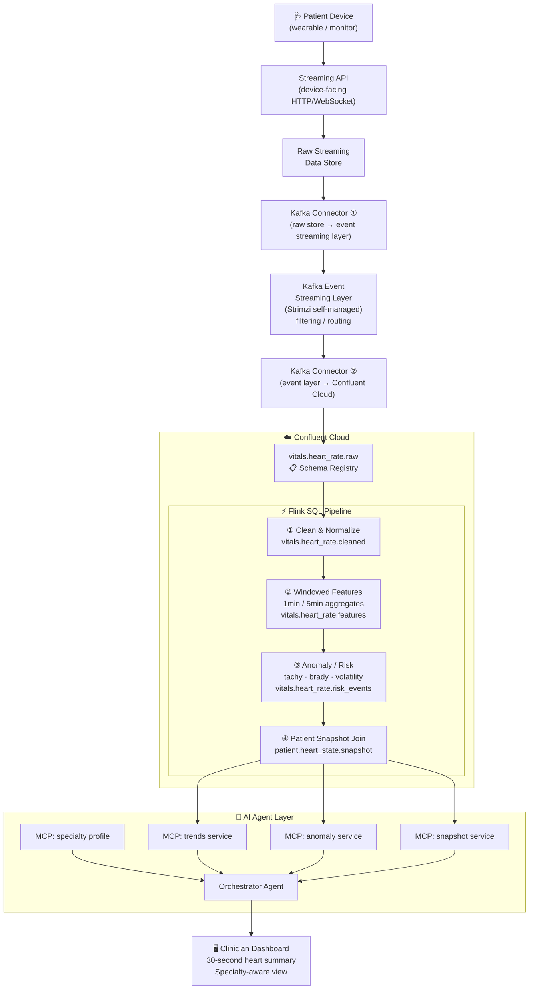

# Confluent AI Day 2026 — Heart Health 30-Second Summary Plan

## 1) Goal
Build a **hackathon demo** that ingests heart-rate events through the following pipeline and produces a **30-second patient heart health summary** via AI agent tools:

1. A **device-facing streaming API** receives raw vitals events from patient devices.
2. A **Kafka Connector** publishes those events from the **raw streaming data store** into the input topics of a **Kafka-based event streaming layer** (self-managed with Strimzi), where stream processing (filtering, routing) may occur.
3. A second **Kafka Connector** bridges the processed output topics from that layer into **Confluent Cloud**, making data available for governed, Flink-powered processing.
4. **Flink SQL** cleans, enriches, and aggregates the stream into high-signal artifacts.
5. An **AI agent** consumes those artifacts via modular **MCP services** and composes the final summary.

Primary judging optimization: **Most Impactful App**
Secondary optimization: strong **Flink-driven processing** and optional Flink AI inference for bonus points.

---

## 2) Decisions Captured (from your preferences)
- **Track strategy:** prioritize **business impact narrative** first.
- **Latency target:** **15–60 seconds** end-to-end (event to refreshed summary).
- **Inference location:** use **Flink AI Model Inference** in-stream (or equivalent model UDF pattern).
- **Agent architecture:** use **modular MCP services** (specialty-aware, composable data tools).

---

## 3) Proposed Demo Story (Business Impact First)
"In under 30 seconds, a clinician gets a specialty-specific heart status summary generated from live streaming vitals and real-time anomaly/risk signals, without pushing raw high-volume telemetry directly into a generic LLM prompt."

Business impact points:
- Faster clinical triage and reduced dashboard overload.
- Better signal quality (Flink cleans/transforms before summary generation).
- Governed, explainable data path with Schema Registry + lineage-friendly topics.

---

## 4) End-to-End Architecture



## 4.1 Source and Ingestion (Confluent Connect)
1. **Source:** heart-rate events produced by a device-facing streaming API, routed through a Kafka event streaming layer (self-managed with Strimzi) into a raw streaming data store.
2. **Connector:** one of:
   - Upstream topic bridge from the Kafka event streaming layer into Confluent Cloud, or
   - JDBC Source / HTTP Source / custom source connector (based on what the upstream streaming layer exposes).
3. Publish into raw topic:
  - `heart-rate-raw`

## 4.2 Governance (Schema Registry + Data Contracts)
- Use **Avro/Protobuf/JSON Schema** with Schema Registry.
- Enforce compatibility mode (recommended: `BACKWARD` for demo evolution safety).
- Add metadata fields in schema for explainability/audit:
  - `patient_id`, `encounter_id`, `event_time`, `device_id`, `source_system`, `quality_score`.

## 4.3 Stream Processing (Flink SQL)
Use Flink SQL jobs to build trusted, enriched heart signals:

1. **Cleaning/normalization stream**
   - Drop impossible values (e.g., HR <= 0 or > physiological threshold).
   - Deduplicate by `(patient_id, event_time, device_id)`.
   - Standardize event timestamps/watermarks.
  - Output: `heart-rate-cleaned`.

2. **Feature stream (windowed)**
   - 1-min / 5-min rolling aggregates:
     - avg HR, min/max, stddev, trend slope, burst count.
  - Output: `heart-rate-features`.

3. **Anomaly/risk stream**
   - Rule-based anomaly flags (tachy/brady thresholds, volatility spikes).
   - Optional: Flink ML/inference function for risk score classification.
  - Output: `heart-rate-risk-events`.

4. **Patient snapshot stream**
   - Join latest cleaned signal + recent features + latest risk status into one compact record.
   - Output: `patient.heart_state.snapshot` (agent-facing topic).

## 4.4 AI Agent Layer (MCP Services)
Use modular MCP services so the orchestration agent can fetch targeted context instead of raw event floods:

- `mcp_heart_trends_service`
  - Returns short trend summary from `heart-rate-features`.
- `mcp_heart_anomaly_service`
  - Returns active/recent anomaly signals from `heart-rate-risk-events`.
- `mcp_patient_heart_snapshot_service`
  - Returns most recent consolidated patient state from `patient.heart_state.snapshot`.
- `mcp_specialty_profile_service`
  - Applies specialty-specific summary template and thresholds (e.g., PCP vs cardiology emphasis).

Orchestrator agent flow:
1. Identify patient + specialty context.
2. Call MCP services for structured, bounded context.
3. Compose a **30-second narrative summary** + confidence/explanation bullets.

---

## 5) Why this avoids “too many data points for LLM”
Instead of prompting on raw telemetry, Flink converts high-volume event streams into:
- compact features,
- anomaly/risk signals,
- latest patient-level state.

The LLM/agent receives only high-signal artifacts, reducing prompt bloat and improving summary consistency.

---

## 6) Suggested Topic and Schema Layout
- `heart-rate-raw`
- `heart-rate-cleaned`
- `heart-rate-features`
- `heart-rate-risk-events`
- `patient.heart_state.snapshot`
- `patient.heart_summary.generated` (optional storage of final summaries)

Schema strategy:
- Canonical raw contract defined in [`schemas/HeartRate.avsc`](schemas/HeartRate.avsc) — registered in Schema Registry using your subject naming strategy (default TopicNameStrategy subject: `heart-rate-raw-value`).
- Add derived schemas for features/risk/snapshot with explicit versioning.
- Compatibility mode: `BACKWARD` (new optional fields only).

---

## 7) Flink Capabilities to Showcase (Hackathon Scoring)
- **Core:** Flink SQL cleaning, transformation, windowed aggregation, joins.
- **Strong bonus path:** Flink AI model inference UDF or built-in ML functions for risk scoring.
- **Demonstrable output:** before/after data quality, live anomaly detection, evolving patient snapshot.

---

## 8) Specialty-Customized Dashboard Strategy (MVP)
Keep one backend pipeline, multiple views:
- **Cardiology view:** arrhythmia risk, variability and trend emphasis.
- **Primary care view:** broad stability + change-from-baseline emphasis.

Both views consume the same snapshot/risk topics but render different summary framing.

---

## 9) 30-Second Summary Output Format (MVP)
Return a structured payload + natural language string:

- `clinical_summary_text` (<= ~120 words, spoken/read in ~30 sec)
- `status` (`stable | watch | critical`)
- `key_findings[]` (3 bullets max)
- `recent_anomalies[]`
- `trend_direction` (`improving | stable | worsening`)
- `confidence_score`
- `generated_at`

Example narrative shape:
"Over the last 15 minutes, heart rate remained elevated with increasing variability and two tachycardia episodes. Current state is watch-level risk. Recommend focused review of rhythm history and recent activity context."

---

## 10) Implementation Plan (when you’re ready)

## Phase 0 — Verify Inputs ✅

### Raw Input Schema
Source topic: `heart-rate-raw`
Schema file: [`schemas/HeartRate.avsc`](schemas/HeartRate.avsc)
Format: **Avro**, registered in Confluent Schema Registry.

| Field | Type | Required | Description |
|---|---|---|---|
| `user_id` | `string \| null` | — | Opaque user identifier |
| `event_id` | `string (uuid)` | ✅ | Unique event ID (alias of legacy `datauuid`) |
| `device_id` | `string` | ✅ | Device identifier (alias of legacy `deviceuuid`) |
| `source_app_id` | `string` | ✅ | Source application identifier (alias of legacy `pkg_name`) |
| `create_time` | `timestamp-millis` | ✅ | Record creation time |
| `update_time` | `timestamp-millis` | ✅ | Last update time |
| `start_time` | `timestamp-millis` | ✅ | Measurement start time (used as Flink event-time source) |
| `end_time` | `timestamp-millis` | ✅ | Measurement end time |
| `time_offset` | `long` | ✅ | UTC offset in milliseconds |
| `comment` | `string \| null` | — | Optional note |
| `heart_rate` | `float` | ✅ | Heart rate in BPM |
| `heart_beat_count` | `int` | ✅ | Total beats during session |
| `min` | `float \| null` | — | Minimum heart rate in session |
| `max` | `float \| null` | — | Maximum heart rate in session |
| `client_data_id` | `string \| null` | — | Producer-defined data ID |
| `client_data_ver` | `int \| null` | — | Producer-defined data version |

### Sample Raw Event
```json
{
  "event_id": "f3a1c2d4-8e67-4b1a-9c3f-0012ab3456cd",
  "user_id": "user-00987",
  "device_id": "dev-watch-4421",
  "source_app_id": "wearable-ingest-service",
  "create_time": 1773757927000,
  "update_time": 1773757929000,
  "start_time": 1773757925000,
  "end_time": 1773757928000,
  "time_offset": -28800000,
  "comment": null,
  "heart_rate": 118.0,
  "heart_beat_count": 59,
  "min": 112.0,
  "max": 122.0,
  "client_data_id": null,
  "client_data_ver": null
}
```

> **Note:** A `heart_rate` value of 118.0 at rest is elevated and would trigger a tachycardia flag in the Flink anomaly stream.

### Ingestion Endpoint
- Connector bridges events from the upstream raw streaming data store into `heart-rate-raw` in Confluent Cloud.
- `start_time` is used as the **Flink watermark source** (event-time processing).
- `event_id` is used as the **deduplication key** in the cleaning stage.

## Phase 1 — Confluent Foundations
- Create topics + Schema Registry subjects.
- Stand up connector from source to `heart-rate-raw`.
- Simulation profile for initial ingest test: **1 patient**, **1 event/second**.

### Phase 1 Implementation Assets (in this repo)
- Gradle Java producer: [`producer`](producer)
- Producer entry point: [`producer/src/main/java/com/hackathon/heartrate/HeartRateProducerApp.java`](producer/src/main/java/com/hackathon/heartrate/HeartRateProducerApp.java)
- Producer runbook: [`producer/README.md`](producer/README.md)
- Connector template: [`connectors/upstream-to-heart-rate-raw.template.json`](connectors/upstream-to-heart-rate-raw.template.json)
- Connector registration helper: [`connectors/register-connector.sh`](connectors/register-connector.sh)

## Phase 2 — Flink Processing
- Implement cleaning SQL.
- Implement windowed feature SQL.
- Implement anomaly/risk SQL (+ optional AI inference UDF).
- Build snapshot join pipeline.

### Phase 2 Implementation Assets (in this repo)
- Flink runbook: [flink/README.md](flink/README.md)
- Table definitions: [flink/sql/00_tables.sql](flink/sql/00_tables.sql)
- Cleaning stage: [flink/sql/10_cleaning.sql](flink/sql/10_cleaning.sql)
- Window features stage: [flink/sql/20_window_features.sql](flink/sql/20_window_features.sql)
- Anomaly detection stage: [flink/sql/30_anomaly_detection.sql](flink/sql/30_anomaly_detection.sql)

## Phase 3 — Agent + MCP
- Implement modular MCP services (trends, anomalies, snapshot, specialty profile).
- Implement orchestrator that composes the 30-second summary.

## Phase 4 — Demo UX
- Dashboard with specialty toggle (same backend, different framing).
- Show trace of one patient from raw event -> cleaned -> risk -> summary.
